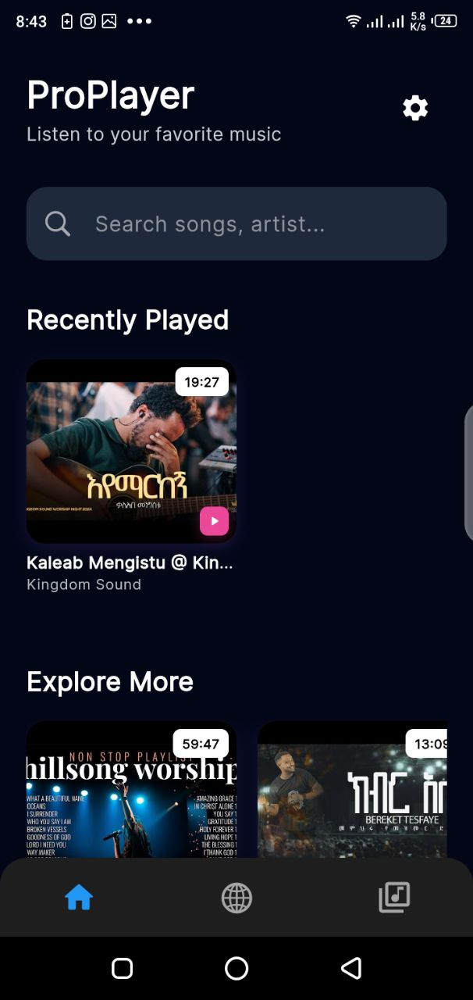
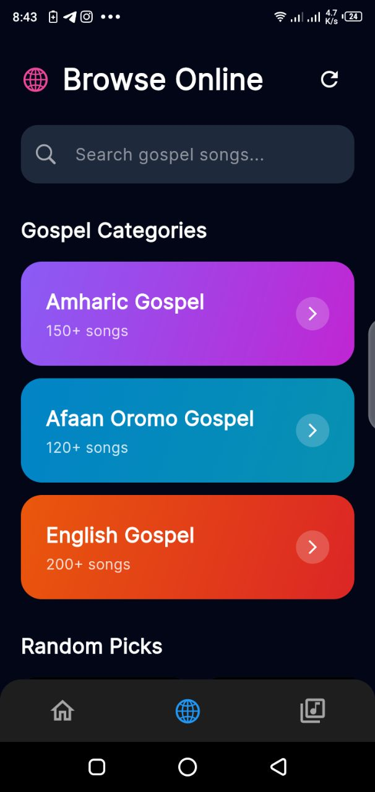
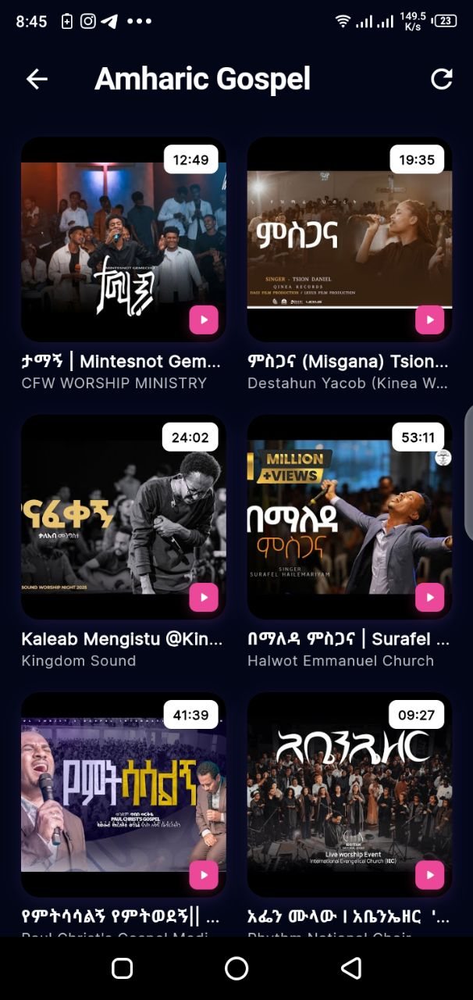
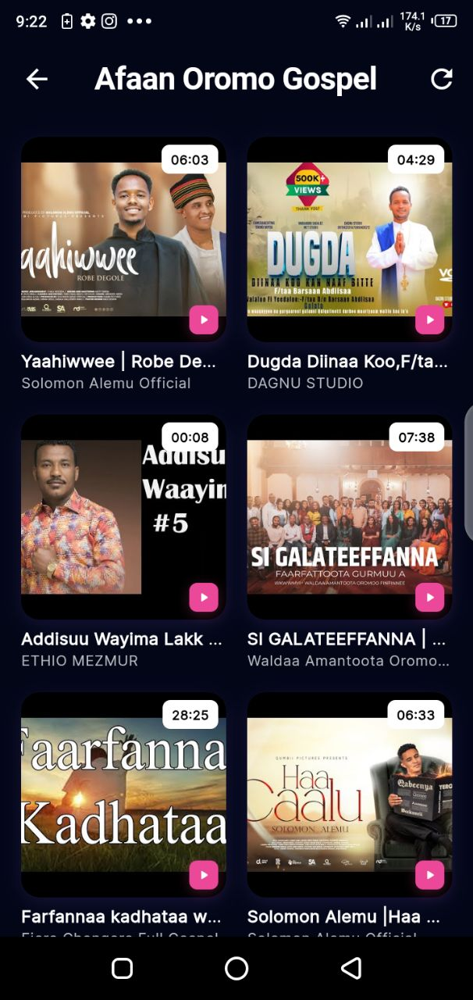
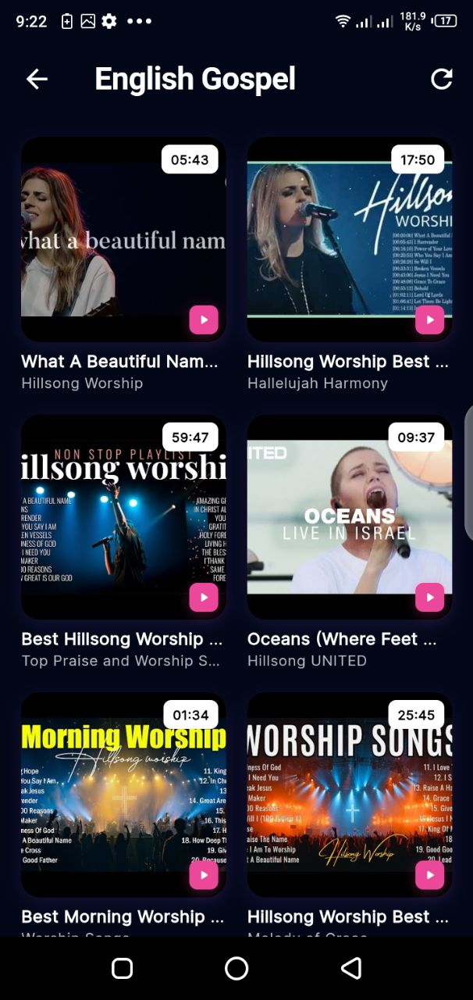
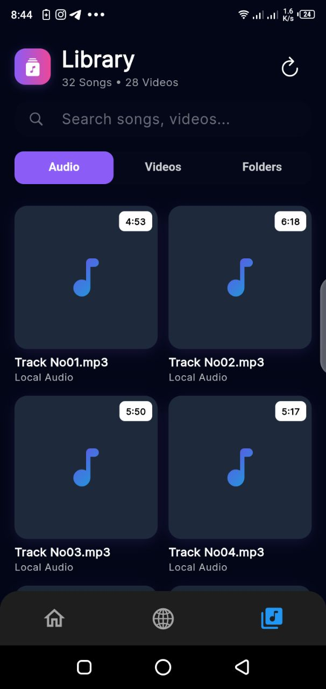
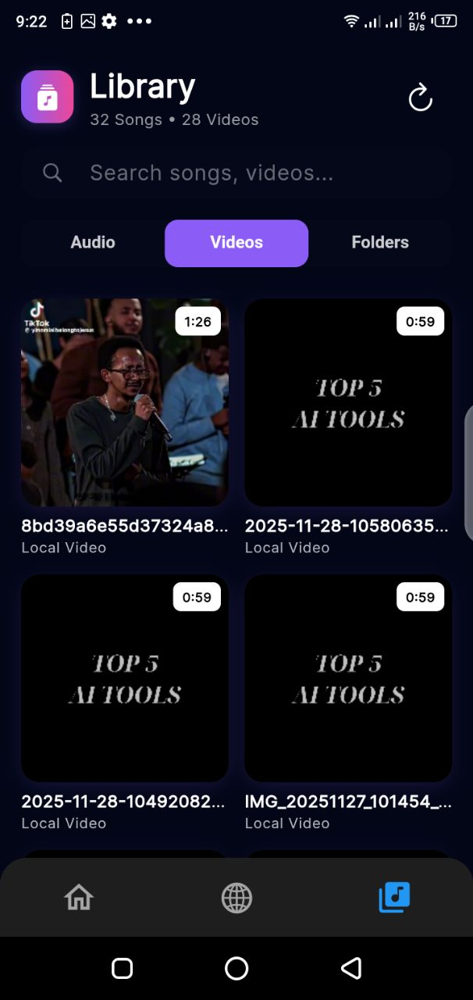
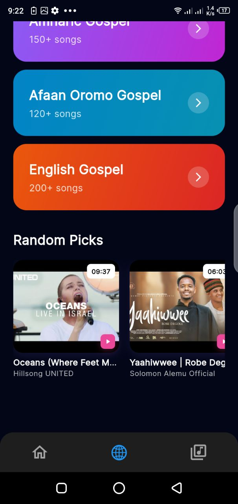

# ProPlayer — Gospel & Local Media Player App

ProPlayer is a cross platform media player built with Flutter. It focuses on two main features:

* Playing **local audio and video files** stored on the device.
* Streaming **Amharic, Afaan Oromo, and English gospel songs** directly from an online source (no downloading).

The app combines a simple, clean interface with smooth playback controls and organized media browsing.

---

## 🖼️ Screenshots

<table>
  <tr>
    <td></td>
    <td></td>
    <td></td>
     <td></td>
  </tr>
  <tr>
     <td></td>
     <td></td>
     <td></td>
     <td></td>
  </tr>
</table>

---
