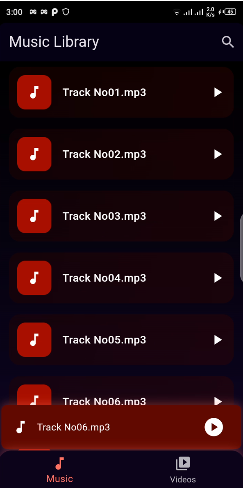
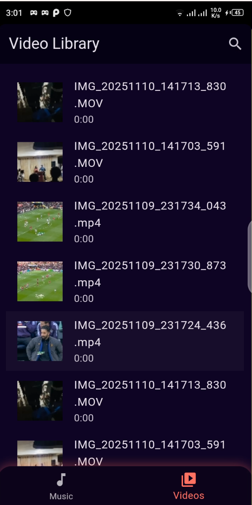
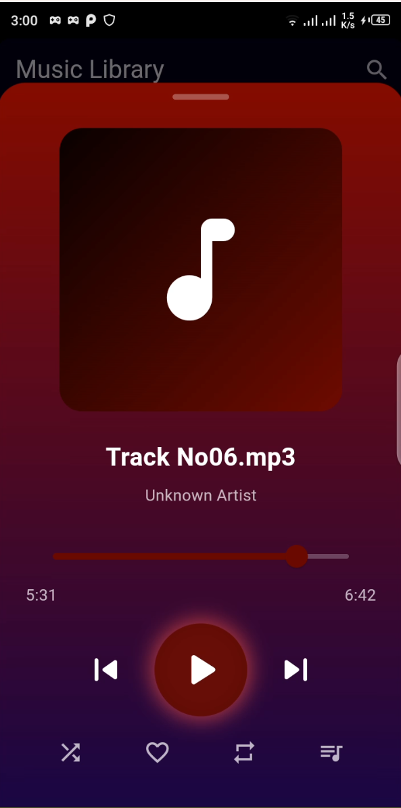
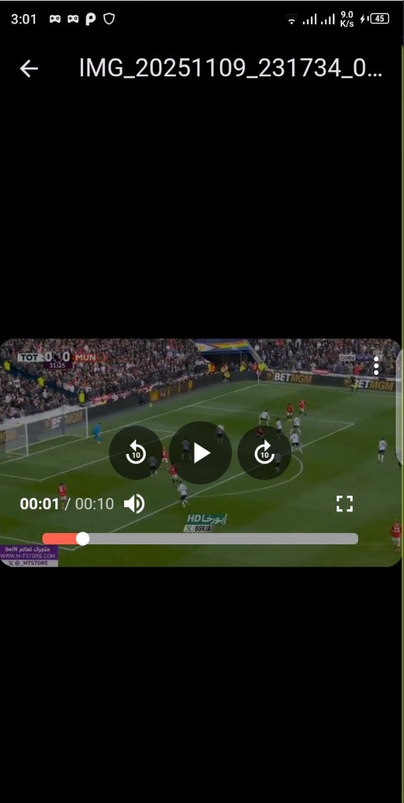

### ProPlay – Local Media Player App ###

ProPlay is a modern Flutter-based local media player for Android that lets you browse and play audio and video files from your device with a sleek, user-friendly interface.

### Features

🎵 Play local audio files

🎬 Play local video files

🖤 Mini player for quick access

⏯ Play, pause, skip forward/backward

📱 Bottom navigation for switching between music and videos

✅ Handles storage/media permissions automatically

🎨 Modern gradient UI with custom controls

### Screenshots:

### Music Library

### Video Library

### Music Player

### Video Player

